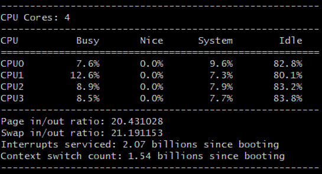

# ProcStat-File-Reader

The ProcStat file reader is a c++ project composed of the main file and three classes, Parse, CPU, and System. This project aims to provide a clean and organized output format of the /proc/stat file present in Linux operating systems. Some of the information contained in the output format is the percentage of execution time that each CPU has in different modes, such as user and kernel, and also the percentage of idle times in all modes.

  

## Software

* GNU C++ compiler (7.3.0).

## License

This project is licensed under the MIT License - see the [LICENSE.md](LICENSE.md) file for details.
